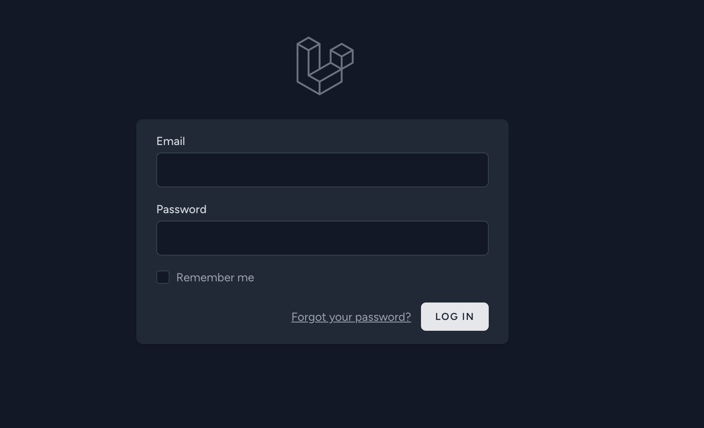
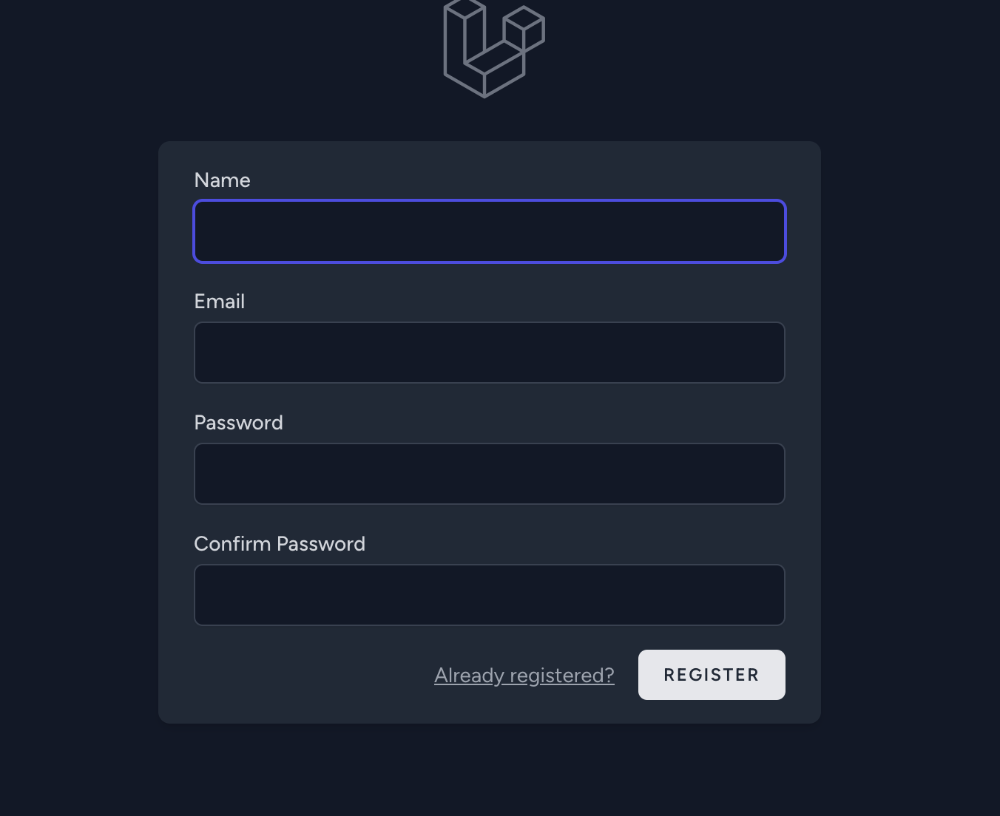
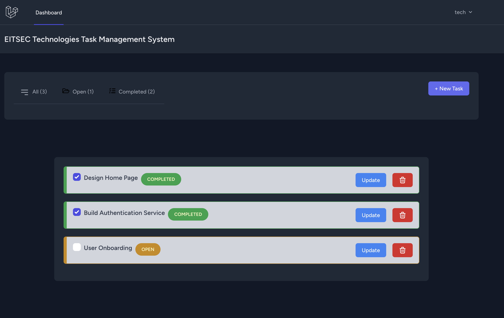
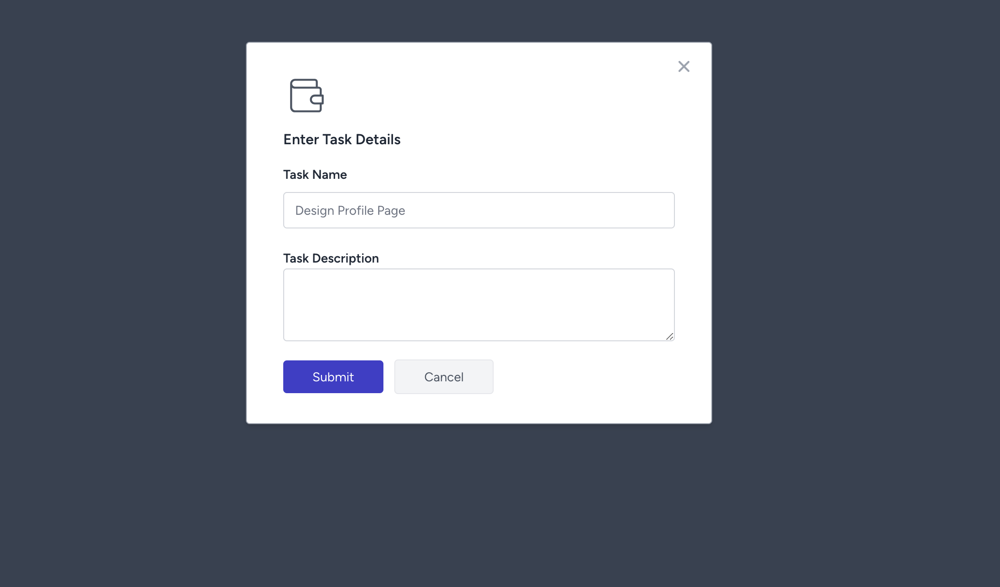
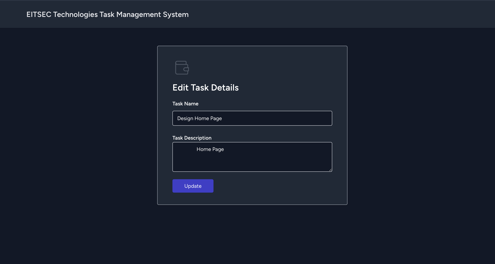

# EITSEC Technologies 

## How to Run
1. Clone Project `git clone https://github.com/coker-felix/task_management_app`
2. install packages `composer install`
3. Generate App key `php artisan key:generate`
4. Add DB info.
5. Run App.

# Screenshots
### Login

### Register

### Home/Dashboard

### Add New Task

### Update Task

